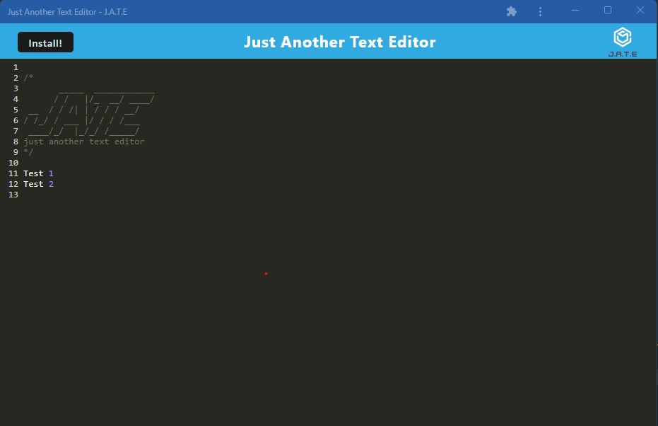
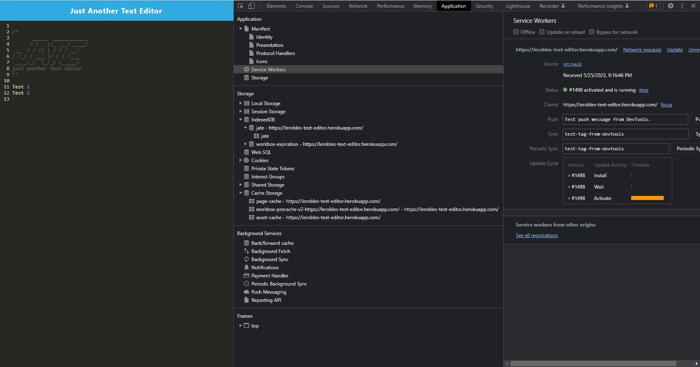

# Jate (Just Another Text Editor)

[Navigate to the website](https://lerobles-text-editor.herokuapp.com/)

Jate is a text editor that runs in the browser. It features various data persistence techniques to ensure redundancy in case any of the options are not supported by the browser. Additionally, the application is designed to function offline. You also have the option to download and run the application locally on your machine.

## Features

- **Browser-Based**: Jate is a text editor that runs directly in your web browser, allowing you to access and use it from any device with a compatible browser.
- **Data Persistence**: The application utilizes multiple data persistence techniques to ensure your text content is saved and accessible even in different scenarios. These techniques may include local storage, IndexedDB, or other suitable mechanisms based on browser support.
- **Offline Functionality**: Jate is designed to function offline, allowing you to continue working on your text files even without an internet connection.
- **Download and Local Execution**: You have the option to download the Jate application and run it locally on your machine. This provides convenience and flexibility, especially when you need to use the text editor offline or in a restricted network environment.

## Usage

To use Jate, simply open the application in your web browser by navigating to the provided URL or accessing it from your local machine after downloading.

## Data Persistence Techniques

Jate implements multiple data persistence techniques to ensure your text content is preserved and accessible across different scenarios. These techniques may include:

- **Local Storage**: Jate may utilize the browser's local storage to save and retrieve your text content. This provides a simple and reliable way to persist data within the browser environment.
- **IndexedDB**: If supported by the browser, Jate can leverage IndexedDB, a more powerful browser-based database system, for efficient storage and retrieval of larger amounts of text data.
- **Fallback Mechanisms**: In case local storage or IndexedDB are not available in the browser, Jate may incorporate additional fallback mechanisms, such as in-memory caching or alternative storage solutions, to maintain data persistence.

Please note that the specific data persistence techniques employed by Jate may vary depending on the browser's capabilities and compatibility.

## Offline Functionality

Jate is designed to provide seamless offline functionality. Once you've accessed the application in your browser, you can continue using it even without an internet connection. Any changes made to your text content will be saved locally within the browser and synced automatically once the connection is restored.

## Download and Local Execution

For added convenience and flexibility, you have the option to download the Jate application and run it directly on your local machine. This allows you to use the text editor offline or in situations where accessing the web version is not feasible. Simply download the application package and follow the provided instructions to execute it on your machine.
